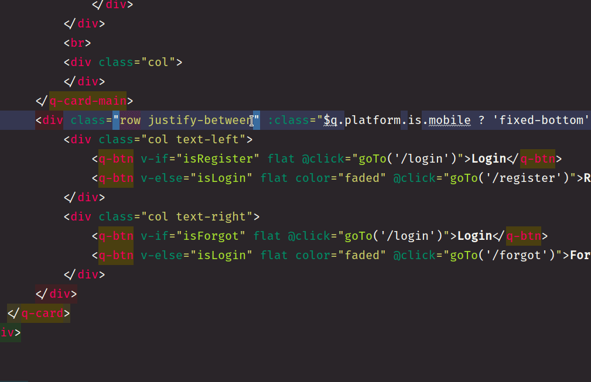

# universal-ide-helper

Boost code completation with shortcurts from many framework/tools
> Currently working only with JetBrains IDE (WebStorm, PhpStorm, etc)

> Works with [Quasar Framework](http://quasar-framework.org) too :)



## Helpers set available

- [Material Design Icons](https://fontawesome.com)
- [Font Awesome Icons 5](https://materialdesignicons.com)
- Much more come soon


## Install

```
$ npm i -g universal-ide-helper
```
or
```
$ yarn global add universal-ide-helper
```
or install helpers without install npm package

```
$ npx universal-ide-helper install
```

## Usage

```
$ ide -h

    Usage: ide [options] [command]
    
    Options:
      -v, --version  output the version number
      -h, --help     output usage information
    
    Commands:
      install        download and install all available ide helpers sets
      helpers        list helper sets available
```

## License

[WTFPL](http://www.wtfpl.net) - DO WHAT THE FUCK YOU WANT TO PUBLIC LICENSE